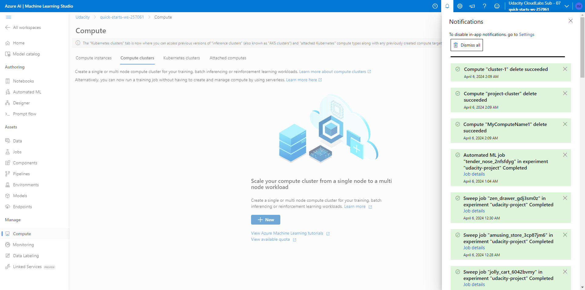

# Optimizing an ML Pipeline in Azure

## Overview
This project is part of the Udacity Azure ML Nanodegree.
In this project, we build and optimize an Azure ML pipeline using the Python SDK and a provided Scikit-learn model.
This model is then compared to an Azure AutoML run.

## Useful Resources
- [ScriptRunConfig Class](https://docs.microsoft.com/en-us/python/api/azureml-core/azureml.core.scriptrunconfig?view=azure-ml-py)
- [Configure and submit training runs](https://docs.microsoft.com/en-us/azure/machine-learning/how-to-set-up-training-targets)
- [HyperDriveConfig Class](https://docs.microsoft.com/en-us/python/api/azureml-train-core/azureml.train.hyperdrive.hyperdriveconfig?view=azure-ml-py)
- [How to tune hyperparamters](https://docs.microsoft.com/en-us/azure/machine-learning/how-to-tune-hyperparameters)


## Summary
This dataset is a bank marketing dataset. We seek to predict term deposit subscriptions. For detailed descriptions, please read [here](https://www.kaggle.com/datasets/janiobachmann/bank-marketing-dataset/data).

The best performing model was a VotingEnsemble model obtained in an automated ML run, with an overall accuracy of 0.91479.

## Scikit-learn Pipeline
The parameter sampler is
```
ps = RandomParameterSampling({
        "--C": choice(.001, .01, .1, 1, 10, 100),
        "--max_iter": choice(10, 20, 50, 100, 200, 500)
    }
)
```
I define a discrete set for each parameter. The benefits of my parameter sampler are its simplicity and fast speed. Of course, its disadvantages include the need to predefine seemingly arbitrary sets and I never know if the optimal parameters are in the sets.

The early stopping policy is
```
policy = BanditPolicy(slack_factor = .1)
```
According to this early stopping policy, any run that falls out of the slack factor of the best performing run will be terminated. Thus, the computational efficiency is greatly improved.

## AutoML
The AutoMLConfig is
```
automl_config = AutoMLConfig(
    experiment_timeout_minutes=30,
    task='classification',
    primary_metric='accuracy',
    training_data=training_data,
    label_column_name='y',
    n_cross_validations=3)
```
The hyperparameters generated by AutoML are
```
algorithm : ['LightGBM', 'XGBoostClassifier', 'XGBoostClassifier', 'LightGBM', 'XGBoostClassifier', 'LogisticRegression', 'XGBoostClassifier', 'LogisticRegression', 'RandomForest']
```

## Pipeline comparison
The Scikit-learn Pipeline yields an accuracy of 0.9094440, thus the AutoML run yields a higher accuracy. The difference looks tiny and may be even insignificant statistically. If any, the difference is because the search space of AutoML is the set of models while the search space of the pipeline is the set of parameters (for a given model). The model selection is a first-order consideration. A good model with bad hyperparameters may be better than a bad model with good hyperparameters.

## Future work
1. Account for the imbalanced nature of the target variable. When the training data have more "no" than "yes", we tend to have models that are better at predicting "no".
2. Use a GridParameterSampling for the pipeline. This is to ensure a more thorough search of hyperparameters.
3. Play around with AutoMLConfig, for example, try different n_cross_validations. The current n_cross_validations may be not optimal. A good choice is the result of the tradeoff between predictability and avoidance of over-fitting.
4. Collect better data with more characteristics. In general, more information does not hurt.

## Proof of cluster clean up
Deleted manually, shown below.

